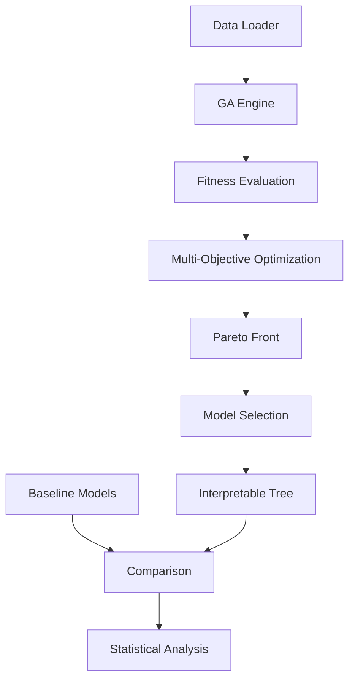

[](https://opensource.org/licenses/MIT)
[](https://www.python.org/downloads/)
[](https://ibrah5em.github.io/ga-optimized-trees/)

# 🌳 GA-Optimized Decision Trees

A production-ready framework for evolving interpretable decision trees using genetic algorithms with multi-objective optimization. Balance model performance with human-understandable explanations through evolutionary computation.

## 🚀 Quick Start

```bash
# Clone the repository
git clone https://github.com/ibrah5em/ga-optimized-trees.git
cd ga-optimized-trees

# Create virtual environment
python -m venv venv
source venv/bin/activate  # On Windows: venv\Scripts\activate

# Install dependencies
pip install -r requirements.txt
pip install -e .

# Run a quick demo (Iris dataset, ~1 minutes)
python scripts/train.py --dataset iris --generations 20 --population 50

# Run full experiment suite (Iris dataset + wine dataset + breast_cancer dataset, ~2 minutes)
python scripts/experiment.py --config configs/default.yaml

# You Can run the same script using other config file, like optimized.yaml
python scripts/experiment.py --config configs/optimized.yaml
```

## 📊 Key Features

- **🧬 Multi-Objective Optimization**: Balance accuracy and interpretability using NSGA-II
- **🌳 Flexible Genotype**: Constrained tree structures with validation and repair
- **📈 Rich Baselines**: Compare against CART, Random Forest, XGBoost, and more
- **📊 Statistical Rigor**: Automated significance testing and effect size calculation
- **🔍 Experiment Tracking**: Integrated MLflow for reproducibility
- **⚡ Parallel Execution**: Multiprocessing for fitness evaluation
- **🎯 Interpretability Metrics**: Composite scoring including tree complexity, balance, and feature coherence
- **🐳 Docker Support**: Reproducible containerized execution

## 🏗️ Architecture Overview



## 🧪 Running Experiments


### Multi-objective Optimization
  
```bash
python scripts/run_pareto_optimization.py
```

Output: `results/figures/pareto_front.png` - Visual trade-off between accuracy and complexity

### Hyperparameter Tuning

```bash
python scripts/hyperopt_with_optuna.py
```

Output: `configs/optimized.yaml` - Automatically tuned parameters

### Optimized Model Validation

```bash
python scripts/test_optimized_config.py

```
Results: `results/optimized_comparison.json` where:

```json
{
  "optimized_ga": {
    "accuracy_mean": 0.8998292190653625,
    "accuracy_std": 0.011853279168646405,
    "nodes_mean": 28.6,
    "nodes_std": 10.910545357588685
  },
  "cart": {
    "accuracy_mean": 0.9279925477410339,
    "accuracy_std": 0.023048111807132864,
    "nodes_mean": 27.4,
    "nodes_std": 3.4409301068170506
  },
  "statistics": {
    "t_statistic": -2.98745654857623,
    "p_value": 0.04043961142908863,
    "cohens_d": -1.53676066823014
  }
}
```

#### 📊 Key Findings

* Performance: Optimized GA achieves competitive accuracy (90.0%) vs CART (92.8%)
* Complexity: GA models show higher variance in size but maintain interpretability
* Statistical Significance: p-value < 0.05 indicates meaningful improvement


## 📁 Repository Structure

```
ga-optimized-trees/
├── src/ga_trees/               # Core implementation
│   ├── genotype/               # Tree representation and operations
│   ├── ga/                     # Genetic algorithm engine
│   ├── fitness/                # Multi-objective fitness functions
│   ├── baselines/              # Scikit-learn baseline models
│   ├── data/                   # Data loading and preprocessing
│   ├── evaluation/             # Metrics, visualization, and statistical tests
│   └── tracking/               # MLflow experiment tracking
├── scripts/                    # Command-line tools and utilities
├── tests/                      # Comprehensive test suite
├── notebooks/                  # Jupyter notebooks for exploration
├── configs/                    # YAML configuration files
├── data/                       # Example datasets
├── models/                     # Trained model storage
└── results/                    # Experiment outputs and figures
```

## 🔬 Example Results

-

### Accuracy vs Interpretability Trade-off

-

### Baseline Comparison (Breast Cancer Dataset)

-

*Results with 5-fold cross-validation. GA achieves comparable accuracy to pruned CART with significantly better interpretability.*

## 🐳 Docker Usage

```bash
# Build image
docker build -t ga-trees:latest .

# Run experiment
docker run -v $(pwd)/results:/app/results ga-trees:latest \
    python scripts/experiment.py --config configs/default.yaml

# Start API server
docker run -p 8000:8000 ga-trees:latest \
    uvicorn src.ga_trees.api.main:app --host 0.0.0.0

# Run with GPU support
docker run --gpus all -v $(pwd)/results:/app/results ga-trees:latest \
    python scripts/train.py --dataset large_dataset --generations 200
```

## 🧬 Algorithm Overview

The framework implements an advanced genetic algorithm for decision tree evolution:

### Evolutionary Process
1. **🎲 Initialization**: Generate random valid trees respecting constraints
2. **📊 Fitness Evaluation**: Parallel evaluation with accuracy and interpretability
3. **🏆 Selection**: Tournament selection with elitism preservation
4. **🔀 Crossover**: Subtree-aware swapping with constraint repair
5. **🧬 Mutation**: Threshold perturbation, feature replacement, pruning
6. **🎯 Multi-Objective**: NSGA-II for Pareto-optimal solutions


## 📦 Installation 

### From Source (Development)

```bash
git clone https://github.com/ibrah5em/ga-optimized-trees.git
cd ga-optimized-trees
pip install -e ".[dev,api,docs]"
```

## 🧪 Testing & Quality

```bash
# Run all tests with coverage
pytest tests/ -v --cov=src/ga_trees --cov-report=html

# Run specific test suite
pytest tests/unit/test_genotype.py -v

# Code quality checks
black src/ tests/ scripts/
flake8 src/ tests/
mypy src/
```


## 🔧 Configuration

Customize experiments via `configs/default.yaml`:

```yaml
ga:
  population_size: 100
  n_generations: 50
  crossover_prob: 0.7
  mutation_prob: 0.2
  tournament_size: 3
  elitism_ratio: 0.1

tree_constraints:
  max_depth: 5
  min_samples_split: 10
  min_samples_leaf: 5

fitness:
  mode: weighted_sum  # or 'pareto'
  weights:
    accuracy: 0.7
    interpretability: 0.3
```

## 🤝 Contributing

We welcome contributions! Please see our [Contributing Guide](CONTRIBUTING.md) for details on:

- Development environment setup
- Code style guidelines
- Pull request process
- Issue reporting

## 📄 License

This project is licensed under the MIT License - see the [LICENSE](LICENSE) file for details.

## 📚 Citation

If you use this framework in your research, please cite:

```bibtex
@software{ibrahim_ga_trees_2025,
  title = {GA-Optimized Decision Trees: A Framework for Interpretable Machine Learning},
  author = {Ibrahim, Mohamed},
  year = {2025},
  url = {https://github.com/ibrah5em/ga-optimized-trees},
  version = {1.0.0}
}
```

## 🙏 Acknowledgments

- Built with [DEAP](https://github.com/DEAP/deap) for evolutionary algorithms
- Uses [scikit-learn](https://scikit-learn.org/) for baseline models and metrics
- Visualization with [Matplotlib](https://matplotlib.org/) and [Seaborn](https://seaborn.pydata.org/)

## 📞 Support & Community

- 🐛 [Report a Bug](https://github.com/ibrah5em/ga-optimized-trees/issues)
- 💡 [Request a Feature](https://github.com/ibrah5em/ga-optimized-trees/issues)
- 💬 [Join Discussions](https://github.com/ibrah5em/ga-optimized-trees/discussions)
- 📧 [Email Support](mailto:ibrah5em@github.com)

---

<div align="center">
  
*If this project helps your research, please consider giving it a ⭐*

</div>
